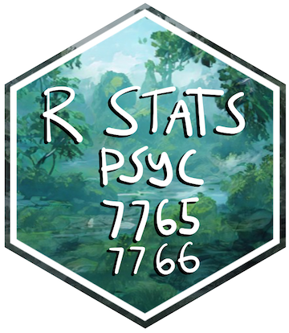

# rstatsmethods 

<!-- badges: start -->

<!-- badges: end -->

## PSYC 7765/66 Statistical Methods Application I

This is the course website for PSYC 7765/66: Statistical Methods Applications I (Fall 2021), offered through the Experimental Psychology Master’s program, Department of Psychology, Brooklyn College of CUNY. 

## PSYC 7765/66 Statistical Methods Application II

This website also contains the labs for Statistical Methods Applications II, to be offered in Spring 2022

Instructor: Matthew Crump
[mcrump@brooklyn.cuny.edu](mcrump@brooklyn.cuny.edu)

